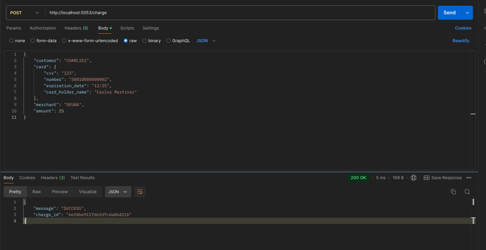
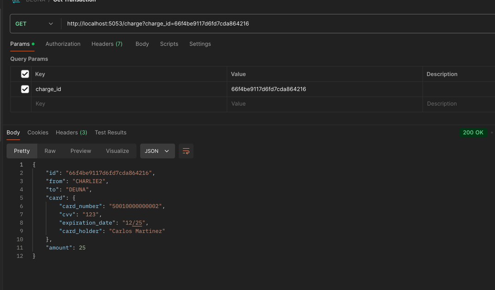
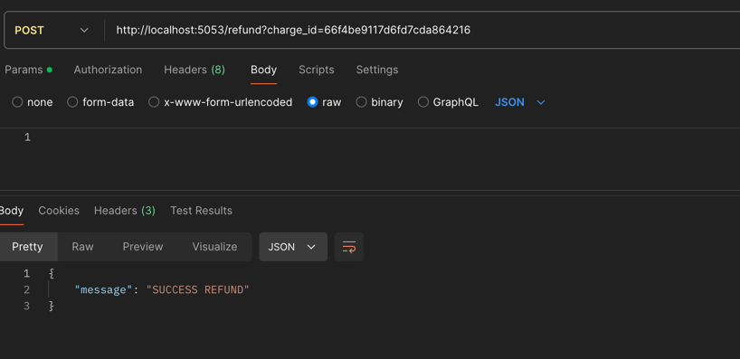

# PAYMENT PLATFORM
Payment platform project as job test.

## Requsites
* Go
* Docker

### Init project commands

```shel
$ go mod tidy
$ go mod vendor
```

### Run docker compose
With docker opened run:

```shel
$ docker-compose up
```
This will run mongo and mongo express images.

Go to http://localhost:8081/ to be sure mongo is up.

### Run main files

Run function main from directory: 
```shel
DEUNA/bank/main
```
This will run the gRPC server used as bank simulator and will create the collections:
* merchant: by default the merchant will be called "DEUNA"
* customer: by default there will be a customer with a balance of 1000

The gRPC server will be listening at:
```shel
http://localhost:5052
```

Run function main from directory
```shel
DEUNA/api/main
```
This will expose API methods in
```shel
http://localhost:5053
```

### Open the json collection in file DEUNA.postman_collection.json

* **Make a payment**: Run Charge request from the collection. This will make a POST request to the API.
You can change any data from body **BUT** field **merchant**. 

Once you run it you will see something like this.

In the database you will see that in merchant collection the field balance will increase plus the amount you sent. Also in the collection customer you will see that balance will be reduced the amount you sent. It will also create a new collection called "transactions" in here you can see all the payments and refunds you make.
You can send this card number to simulate an error from the bank **1234567890**


*  **Get a payment**: Run Get Transaction request from postman collection. Send the charge id that you received previously when you made a charge. Send it as a **query param**
It will respond something like this

*  **Refund a payment**: Run refund request from postman collection. Send the charge id that you received previously when you made a charge. Send it as a **query param**
   It will respond something like this
   
You will notice in mongo that the customer's balance has been increased the amount of the original charge. And the merchant balance will decreased the value of the original amount.

### IMPROVEMENTS

* Create encrypt and decrypt function so card data wont be saved in clear and a token will be saved instead.
* Use environment variables to set credentials for the database connection using a cloud service as SystemManager from AWS SDK.
* Create unit tests for all services.